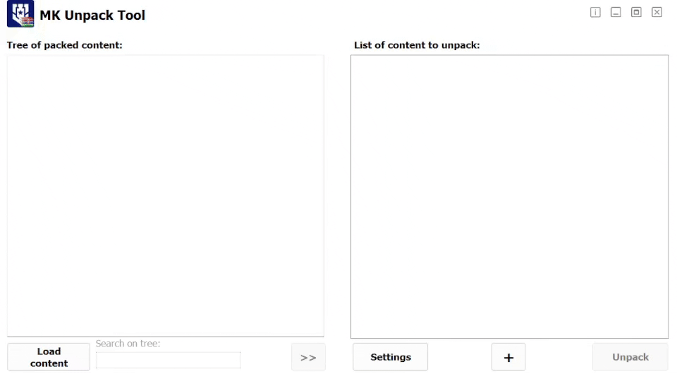

# Tutorial: How to export scripts from Korabli

This tutorial will guide you through the process of exporting scripts from Korabli, a game development platform. Follow these steps to successfully export your scripts.

Acknowledgements to the creators of the MK Unpack Tool, which is essential for this process.

- [MK Unpack Tool: распаковка ресурсов клиента игры](https://forum.korabli.su/topic/123043-софт-mk-unpack-tool-распаковка-ресурсов-клиента-игры)
- [GitLab project of Программа MK Unpack Tool](https://gitlab.com/AutoSpy/mkut)

## 1. Download Korabli

`MKUnpackTool.exe` is the tool you need to extract the game files. Download it from the [provided link](https://gitlab.com/AutoSpy/mkut/-/blob/main/MKUnpackTool.exe). Put it into the game directory, for example, `C:\games\Korabli`.

## 2. Extract the Game Files

Run `MKUnpackTool.exe` in the game directory. Click the `Load content` button in the bottom left corner. When loading is complete, select the `scripts` item, then click the `>>` button in the middle bottom. Finally, click the `Unpack` button in the bottom right corner. This will extract the scripts to a folder named `res_unpack\scripts` in the game directory.

